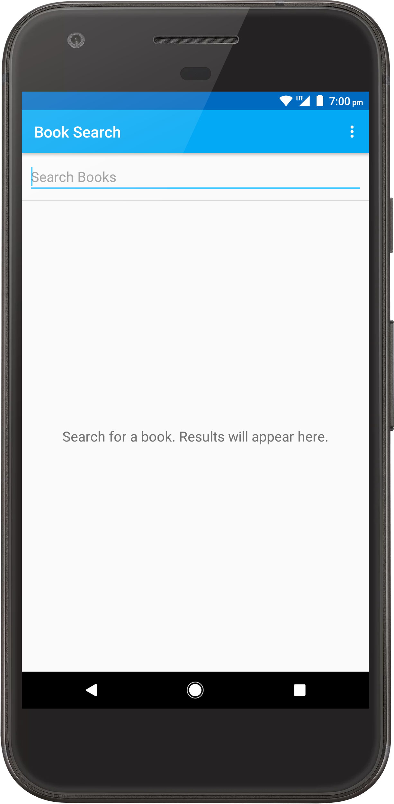
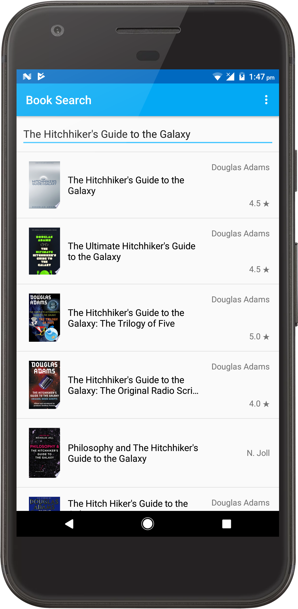
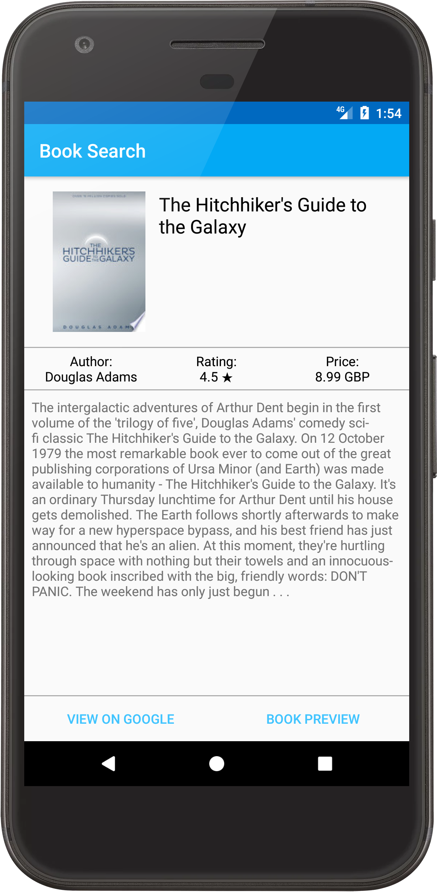

# BookSearch
This app displays a list of books based on user input, and is able to display extensive information about a particular book such as book description, author, price, rating etc.

This app uses the [Google Books API](https://developers.google.com/books) to query for book information.
This app also uses [Picasso](http://square.github.io/picasso) for displaying images and [Chrome Custom Tabs](https://developer.chrome.com/multidevice/android/customtabs) for displaying webpages.

## Screenshots

  
